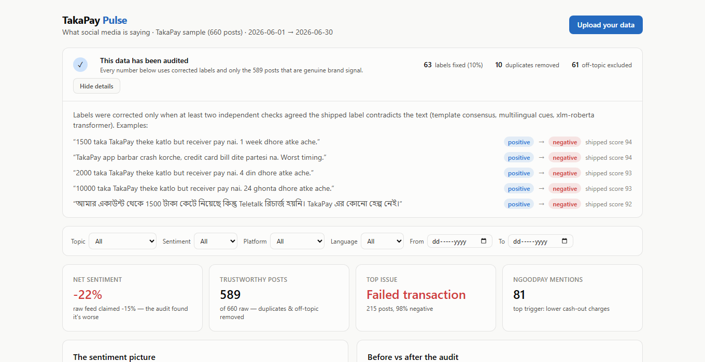
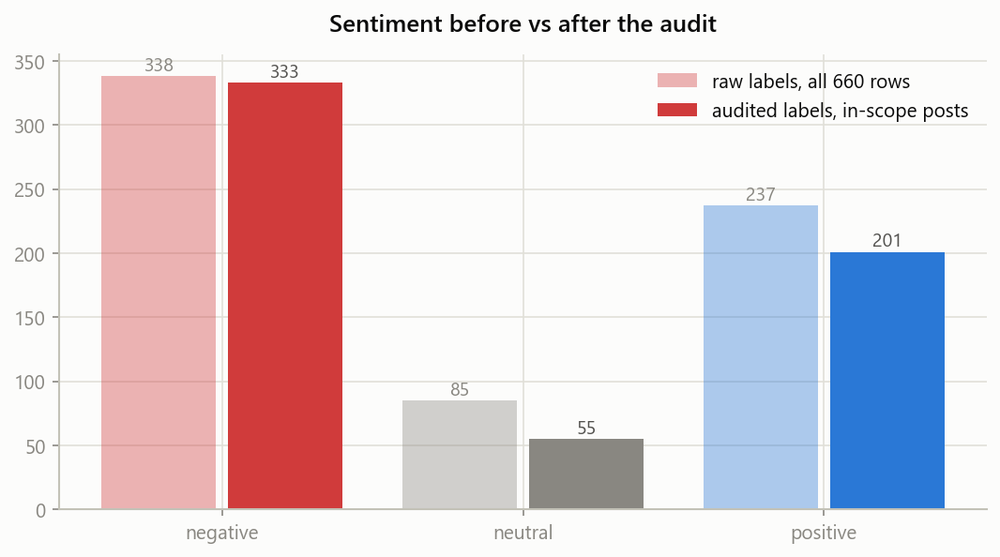
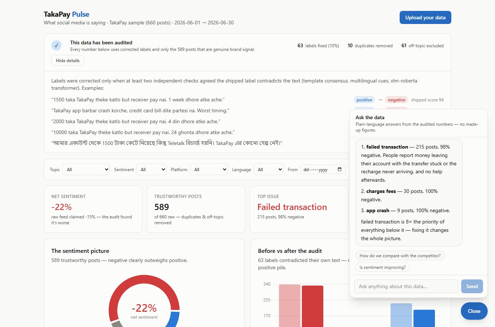
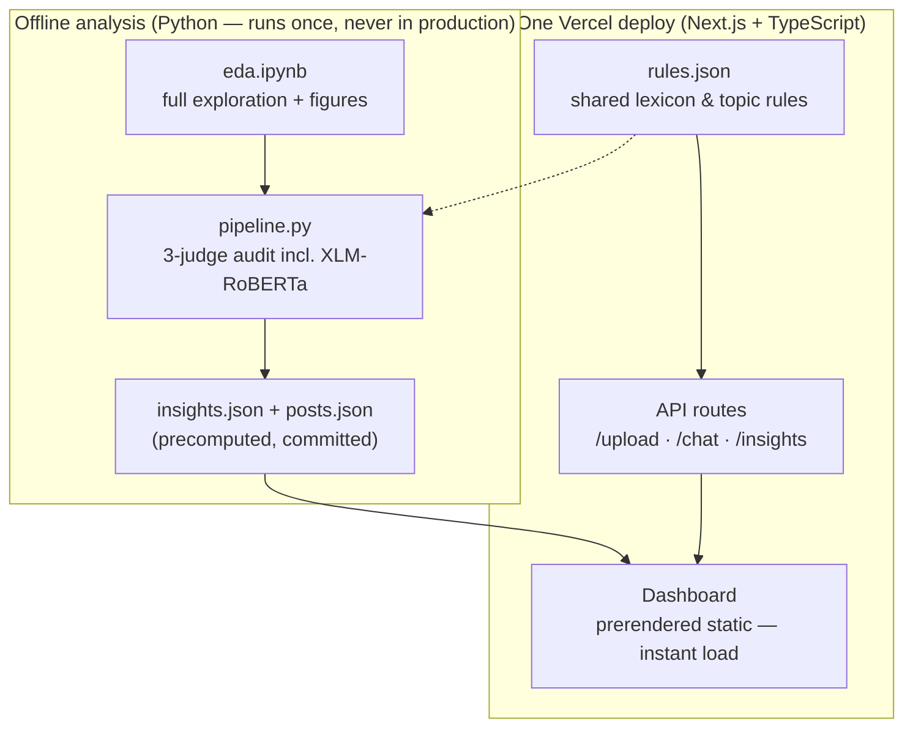

# TakaPay Pulse

**Live demo → [dash-insights.vercel.app](https://dash-insights.vercel.app)**

A dashboard that turns 660 messy, multilingual social-media posts about the mobile wallet **TakaPay** into something a brand manager can read in two minutes and act on the same day. It cleans the data before showing it, explains every chart in plain language, answers questions in a built-in chat — and works with your own CSV/JSON, not just the sample.



---

## The short version

- Net sentiment for June is **−22%** — and the raw data was *hiding* how bad it was.
- **One problem — failed transactions — is a third of the entire conversation** and 98% negative. Fixing it changes everything.
- The competitor (NgoodPay) is winning posts on three concrete things: **cheaper cash-out, better cashback, more agents**.
- **Praise is written in English; pain is written in Bangla and Banglish.** Read only the English posts and you'd think the brand is fine. It isn't.

---

## What I found by actually reading the posts

Before building anything, I went through the feed post by post. Three posts changed the whole design of this tool.

**Post #1566** (Facebook) — the label says **positive**, sentiment score **94**:

> *"1500 taka TakaPay theke katlo but receiver pay nai. 1 week dhore atke ache."*
> ("TakaPay deducted 1500 taka but the receiver never got it. It's been stuck for a week.")

That is a furious customer, shipped into the data as a fan. It isn't a one-off — **63 of the 660 labels (10%) contradict what the post actually says**, and most of the errors hide complaints inside the positive pile. The `sentiment_score` column can't catch this, because it turns out to be nothing more than the label restated as a number (negative posts score 6–30, positive 46–94 — the two never disagree). The only way to catch it is to understand the text itself, in Bangla and Banglish.

**Post #1146** (Reddit) — `brand_mention` says **True**:

> *"Traffic ajke Farmgate e insane, 2 ghonta laglo pouchte."*
> ("Traffic in Farmgate is insane today, took me 2 hours to get there.")

A post about traffic. It never mentions TakaPay — or any wallet — yet the data flags it as a brand mention and labels it *positive*. In fact `brand_mention` is True on **all 660 rows**, including 61 off-topic posts about weather, traffic and biryani. A naive dashboard would count a biryani review as TakaPay praise.

**Post about NgoodPay** (the competitor, 81 posts):

> *"NgoodPay er cash out charge 500 e onek kom, tai TakaPay chere switch korlam."*
> ("NgoodPay's cash-out charge is much lower at 500, so I left TakaPay and switched.")

Competitor posts aren't idle chatter — people name the exact reason they're leaving. Cash-out charges come up 31 times, cashback 30 times, agent coverage 13 times. That's a pricing to-do list, written by the customers themselves.

There were also **10 posts duplicated under different IDs** (cross-posting or spam — counting them twice inflates whatever they say).

**The conclusion that shaped the product:** the most valuable thing this tool can do is not draw charts — it's to make sure *what reaches the charts is true*. So the data gets audited first, and the dashboard shows its work.

---

## How the audit works (in plain words)

A label is corrected only when **at least two independent checks agree** it's wrong:

1. **Template matching** — these posts follow repeated patterns ("sent X taka to my brother, went through instantly"). If 42 near-identical posts are labeled negative and 3 identical ones are labeled positive, those 3 are almost certainly mislabeled.
2. **Multilingual cue rules** — a transparent list of Bangla/Banglish/English phrases ("কেটে নিয়েছে", "atke ache", "robbery" → negative; "সাথে সাথে চলে গেল", "darun offer" → positive). Every rule is a line in a JSON file anyone can read.
3. **A multilingual language model** (XLM-RoBERTa, trained on social media in 100+ languages) reads each post independently.

Two judges must agree before anything changes — a deliberately cautious bar, because a tool that "corrects" data wrongly is worse than one that doesn't correct at all. The result: 63 corrections, and net sentiment moves from −15% (raw) to **−22% (real)**. The full working is in the [analysis notebook](analysis/notebooks/eda.ipynb).



---

## What's on the dashboard, and why a brand manager would care

| What you see | What you do with it |
| --- | --- |
| **Data-trust panel** (top of page) | Know the numbers are real. Click "See what was fixed" to check my work — every correction is shown with the original post. |
| **Fix-first ranking** | Your Monday priority list. Failed transactions score **8× higher** than everything below — volume × negativity × attention, not just post counts. |
| **TakaPay vs NgoodPay** | The three switching triggers, counted and quoted. Take the cash-out charge comparison to the pricing meeting. |
| **Daily trend** | 28 of 30 days were net-negative; the worst day (June 12, −54%) is marked. Check back after a fix ships to see if it moved. |
| **Language lens** | English posts are 63% positive; Banglish posts are 65% negative. If your monitoring is English-only, you are reading the 20% of the feed that's happiest. |
| **Posts explorer** | The receipts. Every chart drills down to real posts in their original language, with corrected labels marked "was positive →". |
| **"Ask the data" chat** | Ask anything, in English or Bangla — "compare Facebook and TikTok on failed transactions", "what should we fix first?". Answers come from a free-tier LLM that is only allowed to use the audited numbers and real posts; if the LLM is ever unavailable, a deterministic engine computed from the same numbers takes over automatically. |
| **Filters** | Slice everything by topic, sentiment, platform, language or date — all charts recompute instantly. |



More figures from the analysis: [fix-first ranking](analysis/figures/07_priority.png) · [language lens](analysis/figures/10_language_lens.png) · [competitor themes](analysis/figures/09_competitor.png) · [full dashboard, light](assets/full-light.png) / [dark](assets/full-dark.png)

---

## Bring your own data

Click **Upload your data** and drop any CSV or JSON (≤4 MB / 20k rows). Only a text column is required — common column names are auto-mapped (`likes`→reactions, `content`→text, `label`→sentiment…), language is detected from the script, topics are inferred from keywords, and the same audit runs before anything is charted. Missing sentiment labels? The pipeline scores the posts itself.

---

## Architecture



The audited numbers for the sample dataset are **precomputed and bundled with the page**, so the dashboard renders instantly with zero server calls — the server is only involved for uploads and chat. Python and TypeScript share one rules file (`rules.json`), so the audit logic can't drift between the notebook and the app.

### Decisions, and the alternatives I rejected

| Decision | Alternative | Why I chose this |
| --- | --- | --- |
| Audit the data before charting it | Chart the labels as shipped | Post #1566 above. A dashboard that counts angry customers as fans is worse than no dashboard. |
| Require 2 of 3 judges to agree | Trust the ML model alone | The model hedges on Banglish. A wrong "correction" destroys trust in the whole tool, so precision beats recall here. |
| Heavy ML offline only; deterministic rules in production | Run the transformer on the server | No free host runs a 1.1 GB model (HF Spaces dropped free Docker hosting in 2026). Precomputing gives the same quality for the sample data at zero cost and zero cold-start risk. |
| One Next.js deploy, TypeScript API routes | Separate Python/FastAPI backend | At 660 rows the backend was just parsing and counting — not worth a second service that can cold-start for 50 s during review. Python still does the heavy analysis, offline, where it's strongest. |
| Deterministic chat engine as the floor, LLM on top | LLM-only chat | A chatbot that misquotes numbers to a brand manager is a liability. The live demo uses a free-tier LLM (Groq) that is grounded in the audited aggregates, a topic×platform table and retrieved real posts — and if the free quota ever dies mid-review, the deterministic engine answers from the same numbers instead of the chat breaking. |
| Engagement as a tie-breaker, not a headline | Rank issues by reactions | Reactions in this dataset are uniform random noise (0–500, zero correlation with anything) — real engagement is heavy-tailed. Treating synthetic numbers as signal would be pretending. |

---

## What I'd do with another week

- **Alerting** — "negative spike on failed transactions today" pushed to Slack/email, instead of waiting for someone to open a dashboard.
- **Aspect-level sentiment** — one post can praise cashback *and* curse support; splitting those gives cleaner topic scores.
- **A proper Banglish sentiment model** — fine-tune a small multilingual model on labeled Banglish so uploads get transformer-quality scoring too, not just the sample data.
- **Persistence + share links** — store uploads so a filtered view can be shared with a colleague as a URL.
- **Real engagement weighting** — with genuine reaction data, the fix-first ranking gets meaningfully sharper.

## Where AI helped — and where I overrode it

AI tools (Claude) wrote most of the boilerplate: component scaffolding, chart wiring, the CSV parsing plumbing, and first drafts of the notebook cells. That probably saved half the time budget. The places that needed a human:

- **Catching the timezone bug.** The AI-drafted upload code converted timestamps through UTC, silently shifting posts across date boundaries (June 21, 1 AM became June 20) — which would have corrupted the daily trend for every uploaded file. Caught it comparing raw vs API output, fixed it, added a regression test.
- **The engagement call.** The first draft ranked topics partly by reactions. Plotting the distribution showed reactions are uniform random noise, so I demoted engagement to a tie-breaker and documented why.
- **Deciding the audit was the product.** The AI's initial plan treated data cleaning as a preprocessing step. Reading the mislabeled posts convinced me it deserved to be the headline feature — the trust panel exists because of that call.
- **Keeping the chat deterministic.** Against the obvious "wire it to an LLM" instinct: a chatbot that misquotes numbers to a brand manager is a liability. The engine answers from computed aggregates only; the LLM upgrade is optional.
- **Library churn.** The AI initially used a Recharts API (`Cell`) that's deprecated in the installed version — replaced with the current API before it broke a future upgrade.

## Run it locally

```bash
git clone https://github.com/KashshafLabib/dash_insights.git
cd dash_insights/web
npm install
npm run dev        # → http://localhost:3000
npm test           # 28 tests, incl. the known data traps
```

Reproduce the analysis (optional — outputs are committed):

```bash
cd analysis
pip install -r requirements.txt
jupyter notebook notebooks/eda.ipynb   # also runs on Kaggle as-is
python pipeline.py                     # regenerates web/src/data/*.json
```

## Repository map

```text
data/       the 660-post sample (CSV + JSON)
analysis/   Python: EDA notebook, 3-judge audit pipeline, exported figures
web/        Next.js app: dashboard, API routes, TS scoring library, tests
assets/     screenshots used in this README
```
